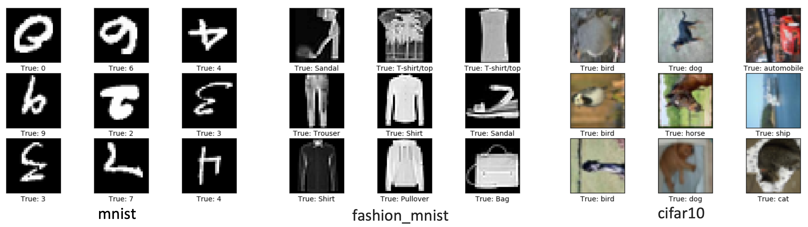
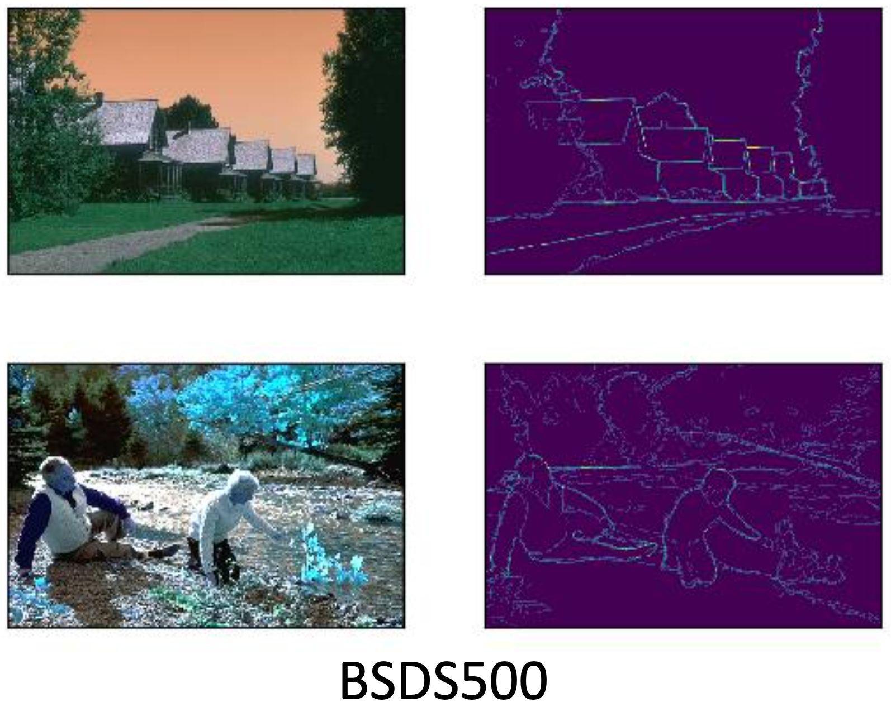
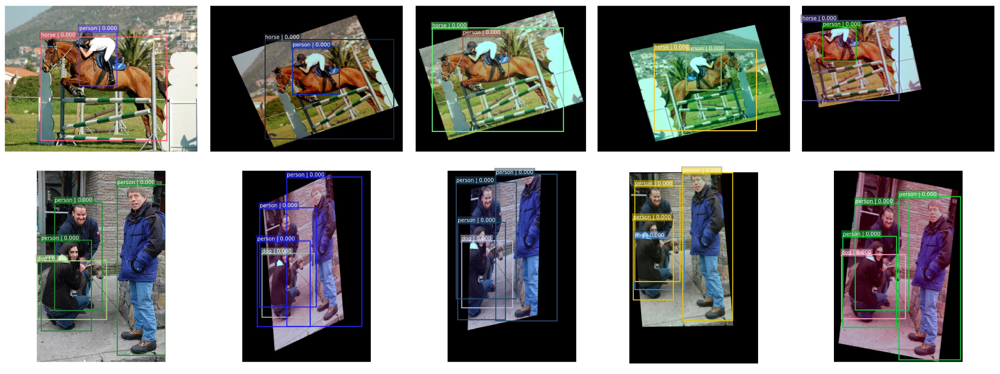

# dataflow-src

**data loading and visualizing pipeline** for image classification, semantic segmention and object detection with augmentation.

## 1. image classification

## 2. semantic segmention

## object detection

## reference

https://github.com/tensorpack/tensorpack/tree/master/tensorpack/dataflow

https://github.com/conan7882/yolov3/tree/master/src/dataflow

https://github.com/Paperspace/DataAugmentationForObjectDetection
